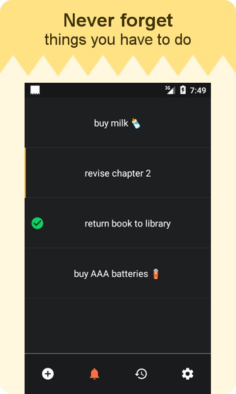
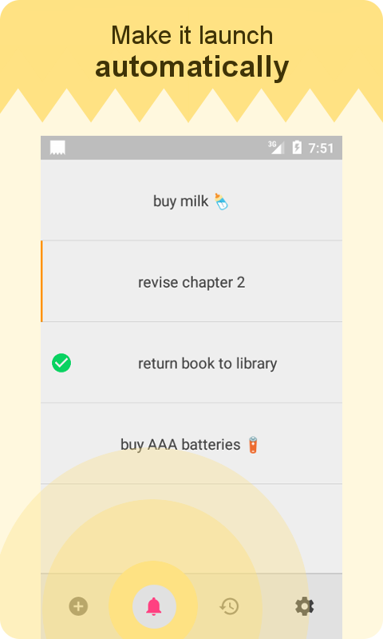
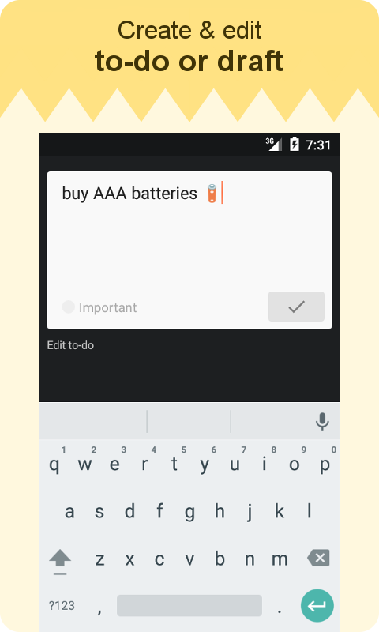
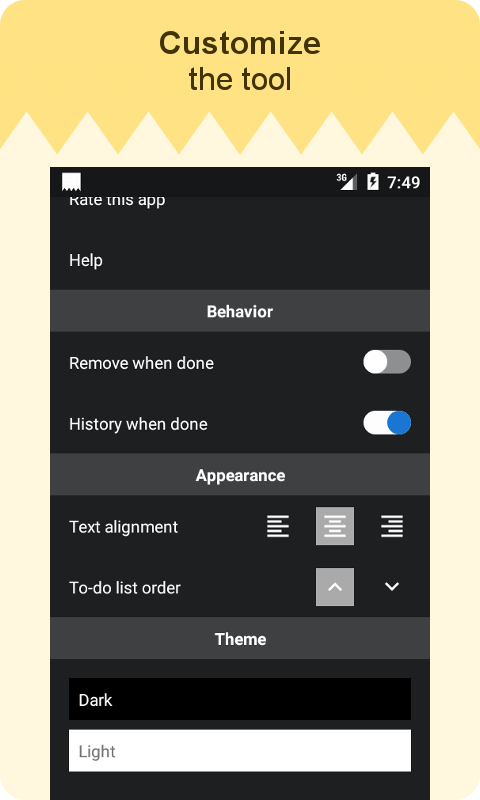

# ToDo Memory

ToDo Memory is a simple, fast and lightweight to-do list app to keep track and remind you about things you'd like to do without dealing too much with the tools itself.

Features:
- Automatically show to-do list when you turn on your screen (configurable)
- Customizable UI, such as Dark & Light theme support

## Screenshots

|||
|--------|--------|
| | |

## License

GPLv3